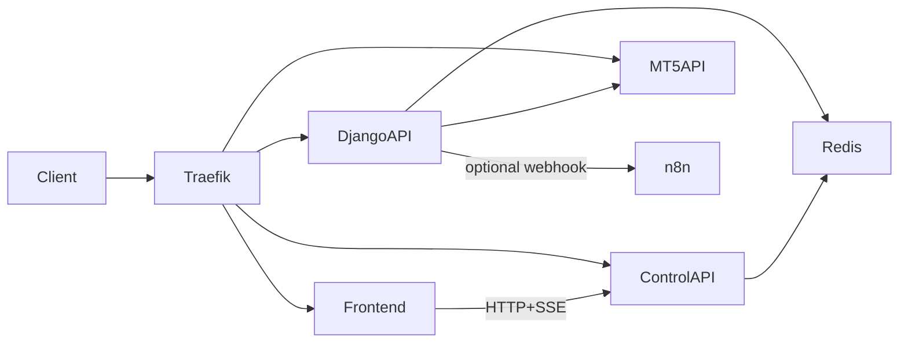

# Architecture

## Snapshot

## Core Components

- `Traefik`: public ingress and TLS termination for domain-routed services.
- `Django API`: trading API + quant orchestration.
- `MT5 API`: execution bridge to MetaTrader functions (`/order`, positions, account, symbols).
- `Control API`: operational control layer (pause, restart, status, SSE stream).
- `Frontend`: UI for operational control and monitoring.
- `Redis`: shared state, control flags, and pubsub.
- `n8n` (optional): workflow automation target for webhook events from arbitrage logic.

## Data Flow: Client API Call To Trade Execution

Example: client sends `POST /v1/send_market_order/`.

1. Client calls `https://<DJANGO_DOMAIN>/v1/send_market_order/`.
2. Request enters Traefik and is routed to `django` service.
3. Django view validates payload and calls `send_market_order(...)` helper.
4. Helper calls MT5 API (`MT5_API_URL`, usually `http://mt5:5001`) `/order` endpoint.
5. MT5 API executes trade via MetaTrader runtime and returns order result.
6. Django reads/serializes resulting trade context and returns response to client.

Notes:
- This path does not require algorithm auto-start.
- With `ENABLE_QUANT_BOOTSTRAP=false`, this API flow remains available.

## Data Flow: Algorithm Execution And Arbitrage Path

When quant bootstrap is enabled:

1. Django app startup invokes quant bootstrap (`QuantConfig.ready()`).
2. Arbitrage workers/threads start:
   - subscription feeds,
   - comparison loop,
   - position sync,
   - net position checks,
   - grid bot logic.
3. Connectors pull Binance/MT5 market or position data and write to Redis keys/channels.
4. Strategy loops consume Redis data and evaluate spread/exposure/threshold rules.
5. If conditions match, algorithm logic may call execution adapters that submit orders to MT5 and/or Binance.
6. `price_diff` can optionally forward computed comparison payloads to `N8N_WEBHOOK_URL`.
7. Control API and frontend consume the shared Redis-backed state for monitoring and controls.

### n8n’s Role In Arbitrage

- n8n is not the execution engine.
- n8n is an optional sidecar automation destination for webhook events (e.g., spread/premium events).
- Typical use: notifications, escalation, integrations, logging pipelines.
- If n8n is unavailable, core MT5 trade execution API can still function; impact is mostly on webhook-driven automation paths.

## Operational Modes

- **API-only mode**:
  - set `ENABLE_QUANT_BOOTSTRAP=false`
  - keep `django`, `mt5`, `redis` running
  - use Django endpoints for trade execution
- **Full quant mode**:
  - set `ENABLE_QUANT_BOOTSTRAP=true`
  - startup quant loops and strategy workers at Django boot
